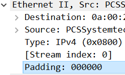

# poll
>[!info]
>poll()  performs  a similar task to select(2): it waits for one of a set of file descriptors to become ready to perform I/O.

<!--more-->


``` cpp

NAME
       poll, ppoll - wait for some event on a file descriptor

SYNOPSIS
       #include <poll.h>

       int poll(struct pollfd *fds, nfds_t nfds, int timeout);
       
```

| 参数      | 值          | 用途                                                                                                                                                                                                                             | 说明                             |
| ------- | ---------- | ------------------------------------------------------------------------------------------------------------------------------------------------------------------------------------------------------------------------------ | ------------------------------ |
| fds     |            | The set of file descriptors to be monitored is specified in the fds argument, which is an array of structures                                                                                                                  | 存储要监视的fd结构体数组                  |
| nfds    |            | the number of items in the fds array                                                                                                                                                                                           | 数组内元素的数量                       |
| timeout |            | the number of milliseconds that poll() should block waiting  for a file descriptor to become ready.                                                                                                                            | 0：立即返回<br>negative value: 一直等待 |
| RETURN  | > 0; 0; -1 | positive number:  the number of structures which have  nonzero  revents  fields (in  other words, those descriptors with events or errors reported).<br>0:  the call timed out and no file descriptors were ready.<br>-1:error |                                |

## 结构体定义
``` cpp
	  struct pollfd {
		   int   fd;         /* file descriptor */
		   short events;     /* requested events */
		   short revents;    /* returned events */
	   };
```

| 参数      | 值           | 用途                                                                                                                                                                                                                                                                          | 说明            |
| ------- | ----------- | --------------------------------------------------------------------------------------------------------------------------------------------------------------------------------------------------------------------------------------------------------------------------- | ------------- |
| fd      |             | The field fd contains a file descriptor for an open file. If this field is negative, then  the  corresponding events field is ignored and the revents field returns zero.                                                                                                   | -1 表示没有要监视的对象 |
| events  | 0 或 监视事件的组合 | an input parameter, a bit mask specifying the  events  the  application  is interested  in  for the file descriptor fd.  This field may be specified as zero, in which case the only events that can be returned in revents are POLLHUP, POLLERR, and POLLNVAL (see below). |               |
| revents |             | The field revents is an output parameter, filled by the kernel with the  events  that  actually occurred.                                                                                                                                                                   | 0表示没有事件发生？    |


## 事件定义

| 名称                                    | 含义                                                                                                                                                                                                                                                                                                        | 说明                          |
| ------------------------------------- | --------------------------------------------------------------------------------------------------------------------------------------------------------------------------------------------------------------------------------------------------------------------------------------------------------- | --------------------------- |
| POLLIN                                | There is data to read.                                                                                                                                                                                                                                                                                    |                             |
| POLLOUT                               | Writing  is  now  possible,  though  a write larger that the available space in a socket or pipe will still block (unless O_NONBLOCK is set).                                                                                                                                                             |                             |
| <font color="#f79646">POLLERR</font>  | Error condition (only returned in revents; ignored in events).                                                                                                                                                                                                                                            | 即使不进行监视，发生该错误时仍然会导致poll（）返回 |
| <font color="#f79646">POLLHUP</font>  | Hang up<br>Note  that  when  reading from  a  channel  such  as a pipe or a stream socket, this event merely indicates that the peer closed its end of the channel.  Subsequent reads from  the  channel will  return  0  (end of file) only after all outstanding data in the channel has been consumed. | 对端关闭时                       |
| POLLRDHUP                             | Stream socket peer closed connection, or shut down writing  half  of  connection.                                                                                                                                                                                                                         | 流式套接字 - TCP 对端关闭连接 或 半关闭输出时 |
| <font color="#f79646">POLLNVAL</font> | Invalid request: fd not open                                                                                                                                                                                                                                                                              |                             |

``` cpp title="poll.h"
/* Event types that can be polled for.  These bits may be set in `events'
   to indicate the interesting event types; they will appear in `revents'
   to indicate the status of the file descriptor.  */
#define POLLIN		0x001		/* There is data to read.  */
#define POLLPRI		0x002		/* There is urgent data to read.  */
#define POLLOUT		0x004		/* Writing now will not block.  */

#if defined __USE_XOPEN || defined __USE_XOPEN2K8
/* These values are defined in XPG4.2.  */
# define POLLRDNORM	0x040		/* Normal data may be read.  */
# define POLLRDBAND	0x080		/* Priority data may be read.  */
# define POLLWRNORM	0x100		/* Writing now will not block.  */
# define POLLWRBAND	0x200		/* Priority data may be written.  */
#endif

#ifdef __USE_GNU
/* These are extensions for Linux.  */
# define POLLMSG	0x400
# define POLLREMOVE	0x1000
# define POLLRDHUP	0x2000
#endif

/* Event types always implicitly polled for.  These bits need not be set in
   `events', but they will appear in `revents' to indicate the status of
   the file descriptor.  */
#define POLLERR		0x008		/* Error condition.  */
#define POLLHUP		0x010		/* Hung up.  */
#define POLLNVAL	0x020		/* Invalid polling request.  */
```


## 关于 POLLHUP 和 POLLRDHUP 的差别

| 属性   | POLLHUP                            | POLLRDHUP                                                       |
| ---- | ---------------------------------- | --------------------------------------------------------------- |
| fd类型 | pipe、stream socket                 | stream socket                                                   |
| 何时   | peer closed its end of the channel | peer closed connection, or shut down writing half of connection |

测试：
实现：
**服务端**
``` cpp
#include <poll.h>
int main()
{
	//... socket、bind、listen
	struct pollfd pfds[5];
	for(int i=0; i<5; i++) {
	    pfds[i].fd = -1;
	    pfds[i].events = 0;
	}

	pfds[0].fd = listen_sock;
	pfds[0].events = POLLIN;
	int num_fds = 1;
	
	for (;;) {

		nfds = poll(pfds, 5, -1);
	    if (nfds == -1) {
			perror("poll");
		    exit(EXIT_FAILURE);
	    }
        printf("Number of events: %d\n", nfds);

	    for (int n = 0; n < 5; ++n) {
			if(pfds[n].fd == -1 || pfds[n].revents == 0)
				continue;

			printf("n:%d event:%hx, revents:%hx,fd=%d\n", n, pfds[n].events, pfds[n].revents, pfds[n].fd);

		    if (pfds[n].fd == listen_sock) {
			    conn_sock = accept(listen_sock,
							   (struct sockaddr *) &clnt_addr, &addrlen);
				//...
			    pfds[num_fds].fd = conn_sock;
				if(eventsType == 0)
			    	pfds[num_fds].events =  POLLHUP; //[!code highlight]
				else if(eventsType == 1)
					pfds[num_fds].events =  POLLHUP | POLLIN; 
				else
					pfds[num_fds].events =  POLLHUP | POLLIN | POLLRDHUP; 

			    num_fds++;
		    } else {
                int r = read(pfds[n].fd, message, sizeof(message));
				printf("Read %d bytes from fd:%d\n", r, pfds[n].fd);
		   }
	   }
	}

    close(listen_sock);

	return 0;
}
```

| 行号    | 功能                    | 说明                                                                                               |
| ----- | --------------------- | ------------------------------------------------------------------------------------------------ |
| 6-9   | 初始化fd集合               |                                                                                                  |
| 11、12 | 设置监视监听socket的POLLIN事件 |                                                                                                  |
| 24    | 遍历整个fd集合              | 因为poll和select 一样只返回符合监听条件的对象的数量，而不是具体的对象集合。所以只能遍历整个对象集合，通过fd 以及 revents 判断是哪个**对象** 发生了何种 **事件** |
| 25、26 |                       | 没有对应的监听对象 或 对象没有发生对应的事件时跳过该对象                                                                    |
| 30-42 | 收到连接请求                | 接受连接请求，并将连接的socket 添加到 监听fd集合中                                                                   |
| 34-40 | 监听 与客户端通信的socket      |                                                                                                  |
| 44、45 | 读取接收的消息               | 客户端连接后会先发送hello，然后再进行shutdown                                                                    |

**客户端**
``` cpp
write(sock, "Hello", 5);
shutdown(sock, SHUT_WR);
close(sock);
```

效果：
监视的事件类型：
POLLHUP
```
ming@ubuntu:/media/sf_share/Network/build$ ./Network 10086
Socket created, listen_sock fd:3
Number of events: 1
n:0 event:1, revents:1,fd=3
Connection established with client, client fd:4, ip:192.168.56.101, port:39766

```
服务单会阻塞在poll( )

POLLHUP | POLLIN
```
Socket created, listen_sock fd:3
Number of events: 1
n:0 event:1, revents:1,fd=3
Connection established with client, client fd:4, ip:192.168.56.101, port:39764
Number of events: 1
n:1 event:11, revents:1,fd=4
Read 5 bytes from fd:4
Number of events: 1
n:1 event:11, revents:1,fd=4
Read 0 bytes from fd:4
Number of events: 1
n:1 event:11, revents:1,fd=4
Read 0 bytes from fd:4
。。。
```

| 行号   | 功能  | 说明                                                |
| ---- | --- | ------------------------------------------------- |
| 1    |     | 监听socket的fd为3                                     |
| 2-4  |     | 收到连接请求，创建的con_sock fd值为4                          |
| 5-7  |     | 收到客户端发送过来的消息 以及 挂断，这里revents是对应POLLIN 事件          |
| 8-10 |     | 尽管client 已经关闭了socket，但是这里还是有 POLLIN 事件产生《=》输入缓冲可读 |

- POLLIN 的含义是 read() 不会阻塞，包括返回0 - 读到EOF
- EOF 会一直存在于输入缓冲中（不会被读走），read()返回后，由于输入缓冲仍然可读所以如果不关闭socket，仍然会产生POLLIN事件

- 实际发生的事件应该 和 fd中event的设置无关（和要监视的事件无关）
- HUP 等事件无需设置，只要发生了该事件poll（）就会返回
如果在添加完con socket 后 close(listen_sock)，运行结果：
``` 
...
Connection established with client, client fd:4
Number of events: 1
n:0 event:1, revents:20,fd=3
accept: Bad file descriptor
```
虽然没有监听POLLNVAL，但是fd集合中包含closed的fd，调用poll（）依然会返回。进行read（）时报错。

POLLIN | POLLHUP | POLLRDHUP
```
Socket created, listen_sock fd:3
Number of events: 1
n:0 event:1, revents:1,fd=3
Connection established with client, client fd:4, ip:192.168.56.101, port:49552
Number of events: 1
n:1 event:2011, revents:1,fd=4
Read 5 bytes from fd:4
Number of events: 1
n:1 event:2011, revents:2001,fd=4
Read 0 bytes from fd:4
。。。
```
事件类型：POLLRUHUP(0x2000) | POLLIN(0x001) 


修改客户端代码，不进行shutdown，直接close。监视以上3个情况下的事件。
运行的结果和上面3种情况相同。

=》即使断开了连接，也不会产生POLLHUP 事件

在shutdown 和 close 两种情况下都会产生 POLLIN 以及 POLLRDHUP 事件，没办法通过事件判断peer 是 shutdown 还是 close。
<span style="background:#fff88f">问：</span>在shutdown 下，client 仍可接收消息，那server 如何区分一个client 是shutdown 还是close？
测试：在read（） 返回0的情况下，向client 发送消息
效果：
``` 
Connection established with client, client fd:4, ip:192.168.56.1, port:5350
Number of events: 1
n:1 event:2011, revents:1,fd=4
Handling event for fd:4
Read 3 bytes from fd:4
...
Number of events: 1
n:1 event:2011, revents:2001,fd=4
Handling event for fd:4
Read 0 bytes from fd:4
write to client, result=3
...
Number of events: 1
n:1 event:2011, revents:2019,fd=4
Handling event for fd:4
Read 0 bytes from fd:4
程序终止
```

| 行号    | 功能  | 说明                                                                                                                                         |
| ----- | --- | ------------------------------------------------------------------------------------------------------------------------------------------ |
| 7-11  |     | POLLRDHUP \| POLLIN，对端的输出已经关闭，read（）返回0。write（）仍然被执行 且 结果为写入的字节数。                                                                          |
| 13-16 |     | 由于EOF的存在，poll（）返回，revents： POLLRDHUP \| POLLHUP \| POLLIN \| POLLERR(0x008)，这里产生了POLLHUP 事件，表示socket已经完全关闭了，对一个已经关闭的socke 进行write（）会造成程序终止 |

<span style="background:#fff88f">问：</span>为什么在收到POLLRDHUP后仍然可以write？
- socket 带有缓冲（有地方可以写入）
- 消息发送给client后，由client的状态确定回复的内容，然后server再确定socket的状态
	- shutdown：client 正常接收消息
	- close：client 回复 Rest，server 收到RST 后将将socket 标记为已断开状态，并产生POLLHUP 事件，此时再向socket 进行write（）就会触发信号，造成程序退出
抓包结果：


Server 收到FIN后再次发送的 【PSH，ACK】包：
-  Seq值是1
- 通常发送的数据在包尾部，但是这个包不一样：

后面的3个字节0x00，对应的是Etherent II 中的Padding



### 实际应用中
如果需要在peer shutdown 之后进行回复，不用管实际是 close 还是 shutdown 都进行一次write（因为第一次write不会报错，且能够发送给peer），然后关闭socket。