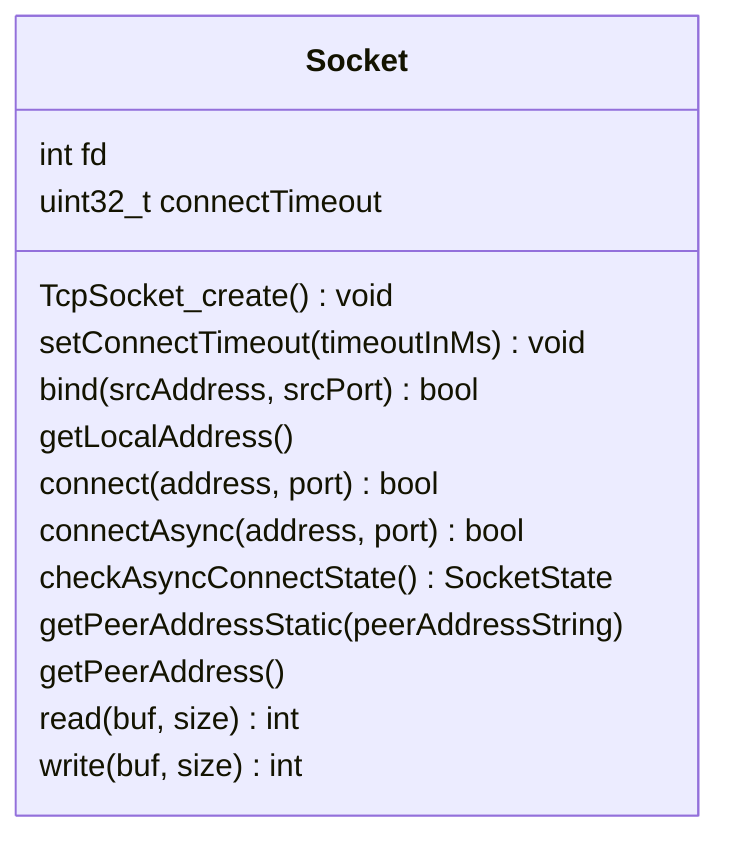
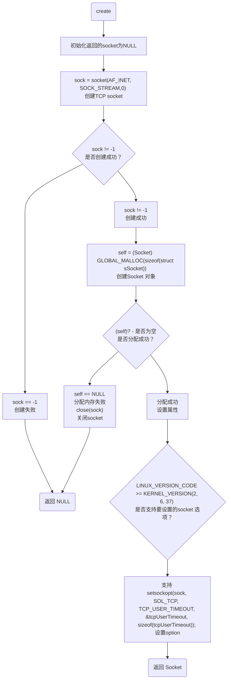
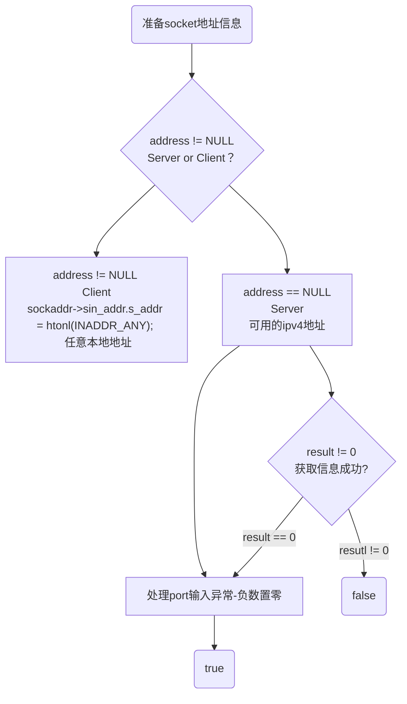
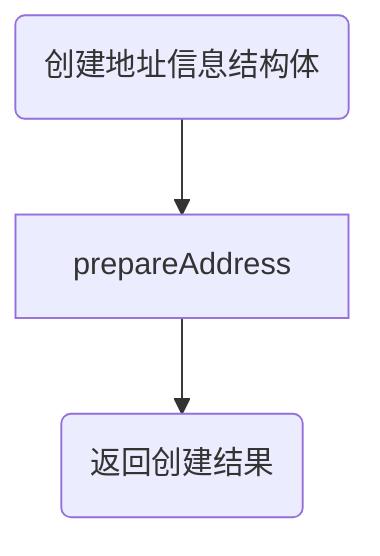
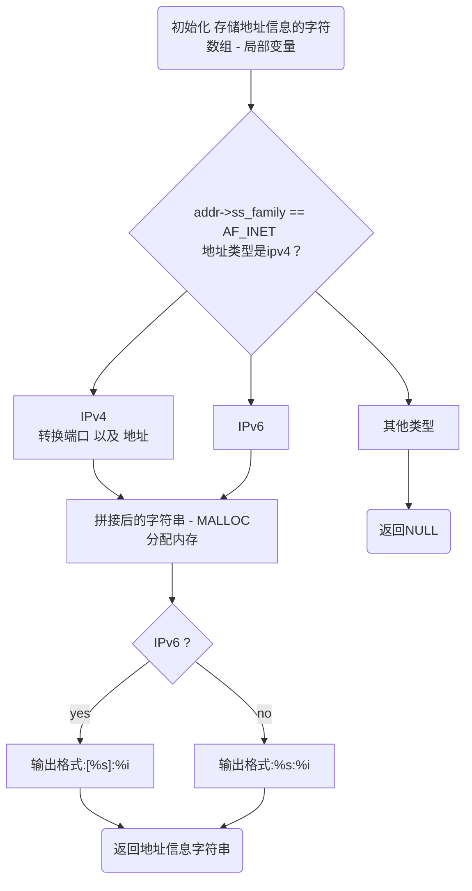
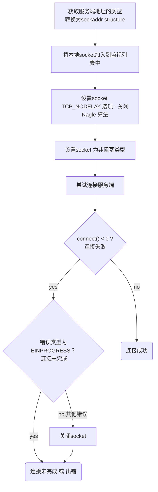
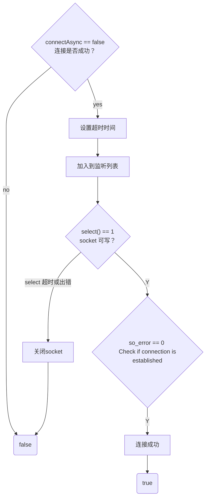

# lib60870 socket

## Socket
TCP client socket


>[!note]
>- 省略了源代码中方法的前缀部分（Socket_），如源代码中bind() 方法的全称是 Socket_bind()
>- 省略了self参数

```cpp
/** State of an asynchronous connect */
typedef enum
{
    SOCKET_STATE_CONNECTING = 0,
    SOCKET_STATE_FAILED = 1,
    SOCKET_STATE_CONNECTED = 2
} SocketState;
```

建立连接前的设置：
- TcpSocket_create：创建socket（）对象
- setConnectTimeout：设置连接超时时间
- bind：绑定地址、端口
- getLocalAddress：获取本地socekt地址信息。在未指定本地地址时-随机分配，通过该接口获取地址信息

连接：
- connect：
- connectAsync：
- checkAsyncConnectState：

连接后：
- read
- write
- getPeerAddress：
- getPeerAddressStatic：
### create



### prepareAddress
```cpp
/*
* \brief 获取可用的地址信息
* \param Server ip 或 NULL
* \param port 端口号
* \param sockaddr_in 返回的地址信息
* \return true 如果成功获取到地址信息，false 无法连接到服务端
*/
static bool
prepareAddress(const char* address, int port, struct sockaddr_in* sockaddr);
```



<span style="background:#fff88f">问：</span>为什么获取地址时只指定了 addressHints.ai_family = AF_INET; 未指定socket 类型？
如果不指定type 那么getaddrinfo（）返回的结果是包含了所有type的？
### bind



### convertAddressToStr
```cpp
static char*
convertAddressToStr(struct sockaddr_storage* addr);
```
[inet_ntop](接口说明补充.md#inet_ntop)




### Socket_connectAsync

<span style="background:#fff88f">问：</span>为什么要设置TCP_NODELAY 选项 - packets will be sent immediately?

<span style="background:#fff88f">问：</span>既然没有用到select，为什么要将socket 添加到fd_set中？

### Socket_connect

<span style="background:#fff88f">问：</span>为什么这里还要通过so_error 是否为0 来判断连接是否建立？前面调用 connectAsync 在connect（）返回0的情况还可能出现没有连接的情况吗？


### Socket_checkAsyncConnectState
通过select（）检查socket是否可写，来判断连接状态。select（）超时时间设置为0 - 立即返回
- 可写（1）：已建立连接
- 超时（0）：正在连接
- 出错（-1）：连接失败


## HandleSet
> A set of server and socket handles

```cpp
struct sHandleSet {
    LinkedList sockets;
    bool pollfdIsUpdated;
    struct pollfd* fds;
    int nfds;
    
    Handleset_new();
    void Handleset_reset();
    void Handleset_addSocket(const Socket sock);
    void Handleset_removeSocket(const Socket sock);
    int Handleset_waitReady(unsigned int timeoutMs);
    void Handleset_destroy();
};
```


| 属性/方法           | 含义/功能 |
| --------------- | ----- |
| sockets         |       |
| pollfdIsUpdated |       |
| fds             |       |
| nfds            |       |
| new             |       |
| reset           |       |
| addSocket       |       |
| removeSocket    |       |
| waitReady       |       |
| destroy         |       |

### new
```cpp
struct sLinkedList {
	void* data;
	struct sLinkedList* next;
};
```
- data：单个节点保存的数据
- next：指向下一个链表
这是一个单向的链表

创建HandleSet 时，只是分配了内存，初始的HandleSet 没有管理的对象，链表中首个节点的data以及next均为NULL。

### addSocket
向handleset中添加socket
前提：handleset 存在 且 socket 已创建
创建一个新的节点，节点数据为socket，并将该节点放到链表的末端

### waitReady
