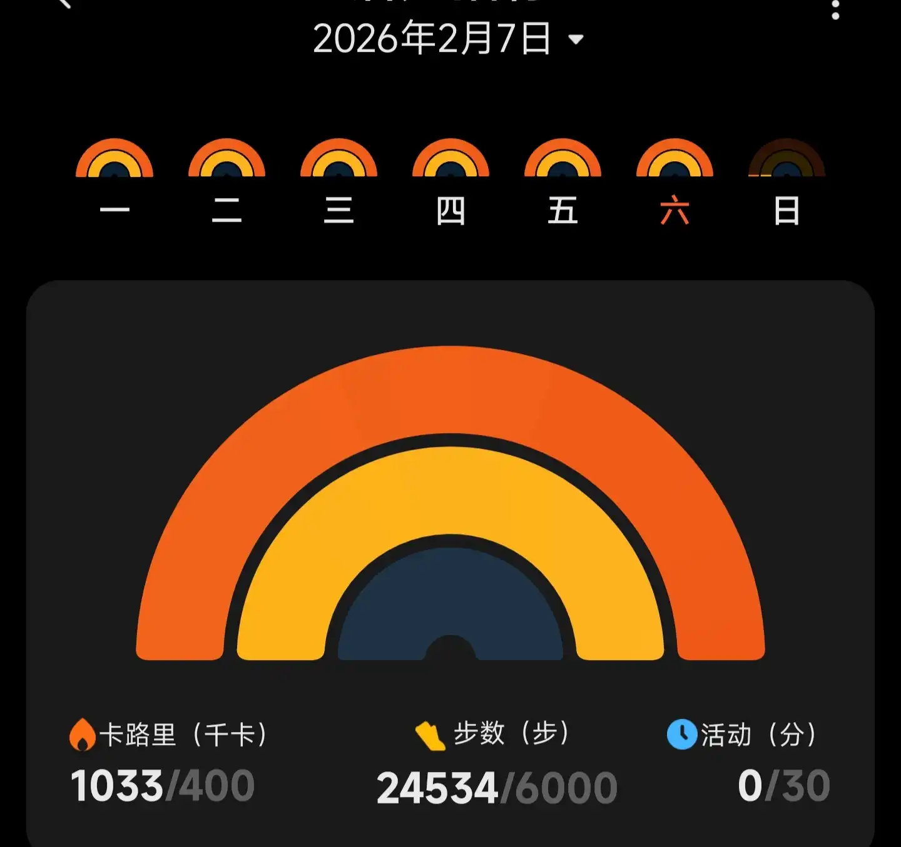
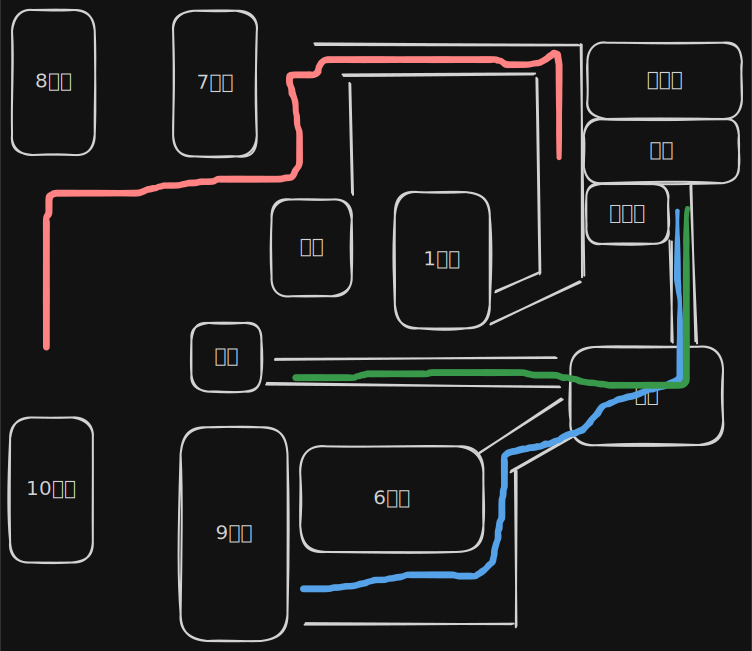

# 酒宴服务员

## 招聘信息
信息来源：公众号
xxx兼职
宴会 15/h
15.30 ~ 22：00 左右 10人
地点：xxx

男女不限，年龄16-60岁，餐扣每餐0.5h，意外险2元，工资次日结，最晚24点前结清。
要穿黑裤黑鞋，没有的酒店提供。

## 实际体验
流水账 - 内容记录：
在工作号上看到了该兼职的消息，对比其他酒店服务员兼职 - 要么太远，要么要求多，要么薪资比这还低，所以选择了这个。首先通过公众号上留的联系方式添加了A，然后被推给了B。
A 应该是人力公司的，同时负责发布招聘信息。然后B应该是A下面的员工，负责部分区域 或 类型的兼职。
B打电话过来确认是否能来，然后A发消息让确认报名，其中包含了提前40分钟到达地铁站集合。
因为黑色袜子洗了没干，所以中午买了一双“羊毛袜” - 5元。下雨，吃过饭之后差不多13点了，懒得走回去，就直接坐公交过去了。
等到了差不多15点，到场地，已经来了不少人。后续又陆陆续续有人过来。清点的时候一共差不多有三十四人。
有两个中介，分属不同的公司。
签到后，由于是第一次做酒店服务员，被分配到传菜。其余人就是在宴会上上菜以及满足客人要求。
跟着传菜的负责人走了一遍宴会厅。
吃饭
上凉菜
上热菜
宴会结束后清理卫生
重新布置会场
在差不多22：30 的时候，负责人通知集合。这个时候因为已经接近地铁停运时刻了，一些人都是坐地铁过来的。并且超过了兼职信息中的下班时间22：00，所以要求下班。但是此时还有宴会厅的卫生都没有做完，餐具没洗出来。所以负责人迫切希望能多一些加班（酒店的全职人员根本没多少）。问了有谁没加班，一看没几个人，就拉着几个认识的要走的让他们加班。对于要走的人 - 赶不上地铁，负责人说是报销车费。
收盘子 、将洗过的器具装车 、摆盘

一直干到半点 - 00：30
我想着我离的也不近-六点几差不多七公里，而且加班到现在 作为一个日结的兼职，因为前面有人报销车费才留下来加班的，是不是也给我报一下？
去和负责人提，勉为其难的把我的上班时间改到了15：00，多了半个小时。让我有其他的有问题和联系人提。走之前和我说 ”还来啊“ 我心里想的是：来个GB，来。当时也很累了，没有言语，直接下楼了。
下楼之后，我一想我打车要差不多15块，这还要我倒贴钱。不行，就把情况和B说了。结果B秒回，说”了解情况后回复你“，我客气了一句，结果没想到B让我明天（今天）再干一天。看来下步数，2万多步。确实累了，不想继续干。回复B”11点前回复“，B说就差我一个人了。心一软，加上还等着报销的车费（去掉补的半小时，也就几块钱），并且B说肯定不会让我加班，就答应了B。
其实我知道这个所谓的 **就差一个人** 99.99%的可能性是假的，不是差一个人，而是差十个、二十个，但是分解为 十个、二十个 ”差一个人“ 就可以了。
哈哈，为什么穷人不敢反抗，因为可能这百来十块钱就能决定命运，起码决定肚子。不是不能赌，而是不敢赌。所以忍气吞声，明知道吃亏也硬着头皮吃下去。吃的多了还心里安慰自己，吃亏是福，吃得苦中苦，方为人上人。更有甚者，反倒教育其别人来，尤其有人鼓起勇气反抗不公，但是被打压的时候。”嘿嘿，没得钱拿了吧。早就和你说过，忍一忍就过去了，非要去拼，现在倒好了，没得钱了，只能饿肚子了。哦豁，看你怎么办“

我就不应该在22：30，大家都要走的时候留下了。不然也不会有这么多的事情。
### 伙食
本来以为在酒店-宴会当服务员起码能吃点好的吧。不说多的，味道起码要过关，菜的种类，什么五花肉、猪肚这种还是有点分量的吧。
结果：
:::tabs
@tab 第一天

大失所望。说是全素也不为过吧。根本看不到肉，萝卜里带了一片、两片。

@tab 第二天

肉末茄子 + 鱼汤，算是改善伙食了
:::

### 步数
:::tabs
@tab 第一天

到家是
2900步
@tab 第二天

:::
### 工作内容
**传菜**
传菜的工具：4层的推车，左右两侧有把手。前后有帘子可以拉下来，起保温以及遮挡的作用。
宴席的分类
- 包场
- 包房
- 散桌
宴会厅的布局：

3条传菜的线路，其中6号厅排散桌
不知道这个编号是哪位高人编的，包房的编号是V2、V3、V5，没有V4。
整体上为什么不按照顺时针依次编号，或者划分为两边，然后一边奇数，另一边偶数。

一桌10人或12人，一场宴多的有16桌，少一点的10桌。大的宴会厅会设置两个点位停放餐车（近点、远点）。每次上菜都是一道菜备齐之后上，区分近、远，避免重复上菜。

- 推车有限，传菜时如果有已经用完的推车需要推回洗碗间。
- 有斜坡的地方需要人在下方抬起推车，避免餐食溢洒

**洗碗**
区分干、湿垃圾，将残余垃圾丢到对应垃圾桶内
不知道具体的清洁标准，酒宴的流程和小菜馆的流程差不多。洗碗阿姨用抹布擦一遍，然后丢到传动式的洗碗机上，洗碗机高温冲刷一遍就算好了。直接从传送带出口拿下来装车 或者 放到餐具架子上，也没有说专用的消毒柜再消毒、杀菌一遍。。。感觉还不如小饭店

小心点，酒店用餐的时候注意看看餐具上有没有上一波客人留下的果粒橙😏

**清理宴会厅**
倒垃圾：先将杯子、小碗内的垃圾倒入大碗中，然后再倒大碗；
擦桌布：我之前以为桌布是清理完表面赃污之后会统一丢到机器里再洗一遍，结果是用抹布浸洗洁水，人工把污渍蹭掉。。。
也没太大的问题，但是有几个地方我觉得如果是我作为消费者会不大舒服
- 还没吃完就开始收：个人认为在酒店 或者 宴会厅吃饭，不仅仅是看重厨师的手艺，更重要的是服务。服务不仅限于用餐的时候，加个餐具、加个菜。。。也包括用餐前，提供道具。。。对用餐场地的使用。
- 擦完一遍就开始摆盘：这个是真有点接受不了。一个桶，一块抹布，擦完之后筷子、勺子，这种放嘴里的器具直接放到桌子上。起码准备两个桶吧，一个清水、一个清洁剂。

**摆盘**
- 骨碟 - 就是盘子：距离桌边缘大概一指宽
- 筷架：放筷子和勺子，骨碟右侧，和蝴蝶上边界平齐
- 杯子：骨碟正上方
- 碗：骨碟左侧
数筷子可以抓起一把然后一边数一边调整筷子方向。

### 评价
**味道**：按规定不能吃宴会上的食物，但是收拾的时候随意。不过我没吃。仅对员工餐评价 - 一般般。不过有一点还算好的，都是现炒的。

**服务**：第一天应该是每个厅都有酒席，有一个厅上了凉菜之后 等了半个小时没上菜。或者等了半天不来一个菜，一来就是来3个。

别的不说，单从菜单上就能看出管理混乱，或者 说没有一个头脑清晰的决策人。不同厅定的菜不同，菜单的样式五花八门。展示给客人的可以根据内容、价格调整，实际传菜的时候要所有菜单统一格式吧。然后每个厅的上菜顺序 - 如何搭配；如果有多个厅同时开席，多个厅之间的上菜顺序。。。

**想法**
宴会是不是也可以像网购一样搞一个下单-》做餐-》配送-》送达-》确认的流程。在厨房和宴会厅之间配个触控屏用来通讯，比用对讲机沟通强多了吧
当然老板不一定是没想法，老板是舍不得花钱。安个机器多贵，人力多划算。

一起工作的同事大部分都是日结工（每个厅都会配一个厅长，厅长应该是正式工），其中一部分人干的时间比较长，都是年轻人，不是年轻人也干不长。上午10点上班，到晚上10点下班，拿个一百五、六的工资，真不知道怎么活下去。
## 成本
:::tabs
@tab 第一天

| 项目  | 费用           | 耗时                              |
| --- | ------------ | ------------------------------- |
| 去程  | 1.8          | 48mins（地图显示时长，实际应该差不多）          |
| 返程  | 14.2（平台优惠4元） | 12mins                          |
| 工作  |              | 15:00 ~ 00:30（这里15：00是达到集合点的时间） |
| 保险  | 2            |                                 |
| 用餐  | 0.5h工时       |                                 |

理论工资：(9.5h - 0.5h) x 15元/h - 2 = 132
实际工资：140.5
净利润：140.5 - 1.8 - 14.2 = 124.5
总耗时：10.5h
平均：11.86 元/h

@tab  第二天

| 项目  | 费用     | 耗时                                                             |
| --- | ------ | -------------------------------------------------------------- |
| 去程  | 1.6    | 48mins                                                         |
| 返程  | 2      | 晚上只有地铁站有公交（需要走个几百米），并且要等到点 或者 是人满了（？）才发车，路上倒是蛮块，但是加在一起耗时应该也差不多 |
| 工作  |        | 15:30 ~ 22：30                                                  |
| 保险  | 2      |                                                                |
| 用餐  | 0.5h工时 |                                                                |

理论工资：(7h - 0.5h) x 15元/h - 2 = 105.5
实际工资：102
净利润：102 - 1.6 - 2 = 98.4
总耗时：8.6h
平均：11.44 元/h
:::

生活真幸福啊
