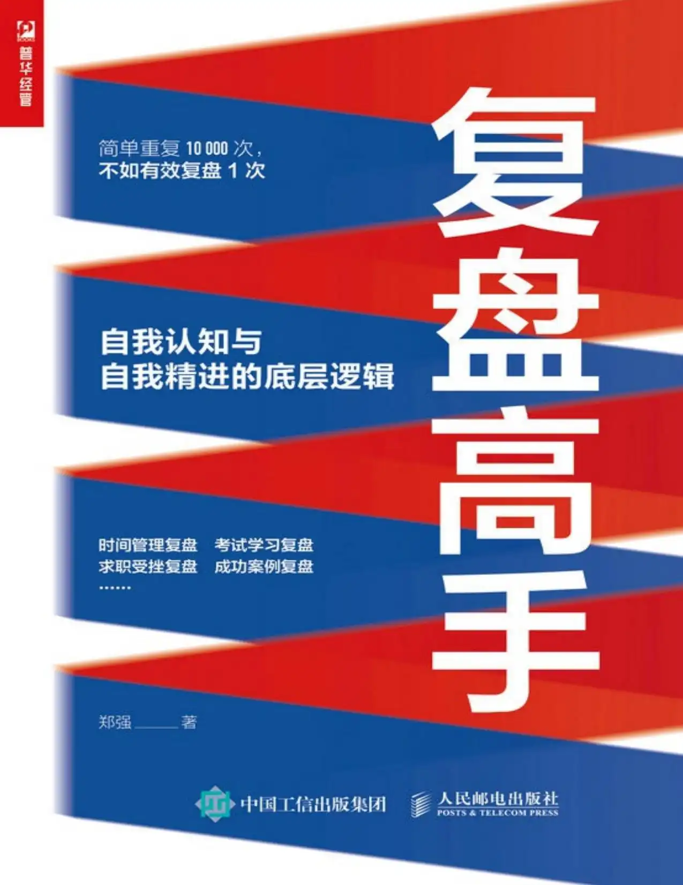
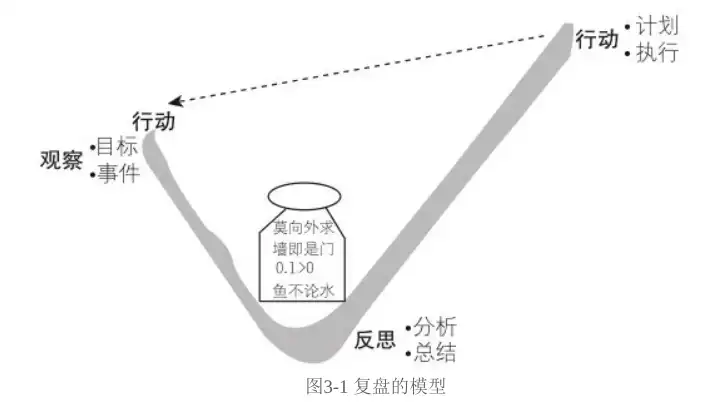
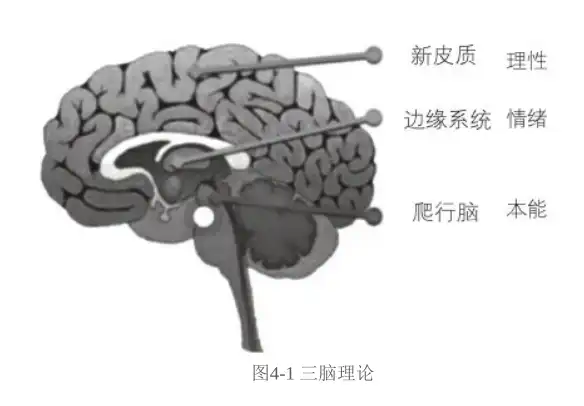

# 复盘高手

<!-- more -->

## 学会复盘，告别低水平的勤奋
### 复盘是什么
>复盘是运用科学的方法，对组织或个人以往的工作进行回顾和思考，发现自己在以往生活和工作中的优点和不足，进而为未来的工作和计划做准备

1. 复盘是一个由意念产生价值的过程：回顾及思考
对复盘过程给予尊重与重视的表现：
- 特定时间：保证复盘过程的完整及流畅
- 合适场所：避免干扰
- 运用合理的工具：借助工具及科学方法进行复盘
- 尊重事实：真实记录，剔除主管臆断

2. 复盘是自我发现的过程：发现真我
复盘的视角
- 与过往事件进行“谈话”的过程：明确目标，重现过往，审视过去，分析改进，总结应用。
- 思考和他人之间的关系：事件与事件之间的关系，参与事件的人之间的关系，选择了事件A，意味着放弃了事件B。如何处理A、B，处理参与及未参与事件的人之间的关系
- 思考我们和我们自己内心的关系：自己的价值观，自己的行为模式，了解真实的自我，而非想象中的、未依据现实的、感觉中的自我

3. 复盘是发挥个人优势的过程：小的成功是大的成功之父
4. 复盘的最终目标是面向未来：更应该关注接下来怎么做
- 复盘的总结可以实施
- 持续复盘

## 复盘的理念

### 莫向外求
- 环境、他人很难改变
- 自我反思的困难：“自我肯定”-自我免疫系统
莫向外求的方法：
- 跳出当局者的层面：从旁观者的角度思考，这个时候就不存在内、外的区别，不容易受自我免疫系统影响，能够从事实出发思考问题
- 积极进行真实的自我察觉：站在更高的视角审视事物

总结：改变观察的视角。如作为一名餐饮行业的员工，可以切换的视角（角色）有：老板，顾客，美食博主，餐饮平台，骑手，物业，城管，环卫工人。
如果要推出一道新品，可以观察的视角：
- 原料供应
- 物流
- 存储
- 味道
- 营养价值
- 营销
- 。。。

### 墙就是门
把困难、问题当作是机会
保持积极的态度：
1. 停止抱怨
区分抱怨 和 倾诉
- 抱怨：基于情绪。产生持续叠加的负能量，影响思维判断
- 倾诉：基于事件本身
两者目的不同，抱怨是为了发泄情绪，倾诉是为了探讨事件，找出原因或者解决办法

2. 全身心地投入
- 情绪状态：
- 行动状态：行动过程中专注于当前事件，不去想成功、失败的结果

3. 重新构建对失败的认知
>失败不是一个事物，而是一种感觉，一种绝望的感觉。

一件事本身没有好坏之分，所谓的成功或失败是人基于心里预期给出的评判。没有走通的路其实也是一种“走通了”的路
4. 信息的再收集
>立刻去分析我们所掌握的信息是否完整。

信息的正确与否，信息的详细程度，信息的数量 影响对事件的掌控程度

### 0.1>0
1. 0.1是一个基础
0.1 操作起来更容易
从0-》100 需要一个过程，一个起点，一个踏板
2. 边走边看的态度
没有办法直接达成目标时，抱着试试看的态度，摸着石头过河，在实施过程中寻找新的解决方案
3. 0.1虽然很小，但无论如何，也比0强
分解问题，化整为零，逐个击破

### 鱼不论水
>在复盘并思考解决方案的过程中，应积极去了解存在于我们周围的资源。

鱼生活在水中，意义不到水的价值。鱼离开了水无法生存。周围的资源相当于是生活的“水”？
我的理解：
1. 资源是生存的根本；没有家人、朋友的陪伴、关心，没有社会、政府提供的服务，个人是无法生存的。这个世界上应该没有单一个体的生命吧
2. 资源相当于生活的水域。资源的数量及质量决定了“水域”里食物的种类及数量。想要生活在一个食物充足，宽广的水域，就要获取优质的资源
资源的类型：
- 母校资源
- 领导或业务专家
- 家人朋友
- 工作单位

>如果想看到更多的景色，就需要跳出水面，获得更广阔的视野

鱼在水中看不到陆地，看不多辽阔的天空。
如果鱼知道鸟是如何捕食的，就能减少被吃掉的风险。
如果鱼能学会鸟的捕食方法，是否能够进化成“飞”鱼，不再困于水中厮杀。从猎物一跃成为猎人，站在食物链的顶端？
如果鱼鸟的捕食方法是否可以伪装，潜伏，引诱鸟，把鸟当作食物。

从不同的视角观察问题：
1. 时间线的视角：
情人节礼物
刚认识的时候-》结婚后
我的理解：时间的变化背后是认知的变化，身份的转变

2. 从他人的角度

## 复盘的流程-按部就班出成果
### 复盘的基本流程
复盘的基本模型：

左：做事的过程。真实还原
中：瓶子代表整体分析的策略。坦诚剖析
右：对未来成果的设想。价值优先

#### 过去的行动并不能指导未来的行动
这里的指导指的是改进、加强未来相同行动
没有中间对过去行动的反思，那么未来行动和过去行动的结果是一样的。
丰富经验：做过的次数多
专家：能够针对现有问题提出解决/改进方法
丰富经验≠专家
丰富经验+持续反思 = 专家

#### 复盘是从观察开始的
>“过去”一定是真实的过去

#### 反思是一个转折点
>只有对过去的事情进行深度且正确的反思，才能真正发现问题（或优势）所在，只有真正地知道了“为什么”，才能有理有据地对未来的行为进行合理规划

#### 复盘的三个步骤是需要严格去执行的
1. 三个步骤不能缺失
2. 三个步骤的顺序不能改变
3. 每个步骤的具体内容完整有效

#### 复盘不是一锤子买卖
>复盘是一个模式，是一个不断迭代的过程

### 复盘中的观察
**目标**
>目标是思考的船锚

1. 发现目标
>动机就是激发和维持我们的行动，并使行动导向某一目标的心里倾向或内部驱力。简单讲，动机是我们做任何事情的出发点。

动机是原因，目标是结果
2. 清晰的目标
感受内心深处的想法；组织语言
SMART原则
- S (Specific): 具体的
- M (Measurable): 可衡量的
- A (Attainable): 可实现的
- R (Relevant): 与其他目标有一定的相关性
- T (Time-Bound): 有明确的截止期限

这里我对 Relevant 的理解是
1. 一个目标可以被分解为多个小目标
2. 目标之间可能有因果，互斥，并列等各种关系

书中的 `目的` 在我看来和 `动机` 是一个意思

### 观察事件
什么是事件？事件的定义及划分
事件的性质：
1. 所有细节必须是事实
2. 不要把预测/推测当事实
3. 事件是可以被证明的

清晰的描述事件的方法：
1. 群策群力：从周围人那里手机更多的信息和事件。个人的观察只是事件的一部分
2. 利用事件描述工具

### 复盘中的反思
垂直思考：
水平思考：多角度；分类

举例说明对一个事件进行垂直思考 与 水平思考的结果

借助思维工具理解问题
思维工具：鱼骨图、思维导图、逻辑树

#### “大胆假设，小心求证”
二八法则：在任何一组事物中，最重要的只占其中一小部分，约为20%。。。
找到关键原因的方法
- 大胆假设：征求靠谱的人的意见假设某个原因是关键的
- 小心求证：如何证明一个原因是关键的
1. 通过各种方法证明判断在逻辑上是正确的
2. 通过各种方法证明判断在行为上正确的

我就搞不懂为什么两个判断举的例子不是同一个，并且个人觉得例子并不恰当。

### 复盘中的行动
#### 计划
5W1H
- What:明确工作内容及要求
- Why: 明确工作计划原因和目的，并论证可行性
- When: 各项任务开始及完成时间，工作进度的管控
- Where:实施地点和场所。地点指的是位置，包括周边环境。场所指的是现场能够提供的空间、工具。。。
- Who:工作人员
- How:措施、流程、相应的支持

#### 实施
提升执行力
1. 从第一件事开始执行
增强回路：“开始”能够影响“结果”，“结果”又影响下一件事的“开始”
起来的第一件事就是执行计划

2. 清除地写出来，这个事情对我们的价值是什么
- 写出来，代表我们对其足够重视
- 写的过程更是一个思考的构成

3. 给自己一个清晰的奖惩机制，当天兑换
4. 用最笨的方法去执行

## 时间管理的复盘，让每一秒都有成果
关于时间管理的3个**递进式**的观点：
1. 时间本质上是不能够被管理的，我们可以管理的是事件
2. 我们做的任何事情，背后都是有原因的
3. 找到事情背后原因的过程，就是找到自己的过程

### 目标的确定

>情绪脑指挥着绝大部分的外界事物与大脑之间的关系。
>只有那些听起来令人兴奋、开心的信息才会被更好地执行

令人兴奋《=》（有）激发效果 = 目标价值 x 目标实现的可能性

对比：
- 有时间谈一个女朋友
- 和xx在情感关系方面有进展（牵手）

### 对时间管理事件的整理、分析及改进方案的执行
**整理**
对过往时间进行重现《=》对事件的描述
1. 收集：如实记录过去一段时间内发生的所有事情
2. 整理：将事件分类
时间管理四象限
- 重要紧急
- 重要不紧急
- 不重要紧急
- 不重要不紧急

**分析**
那些事情可以不做、少做。如何分配时间。。。

**执行**
根据分析的结果执行

