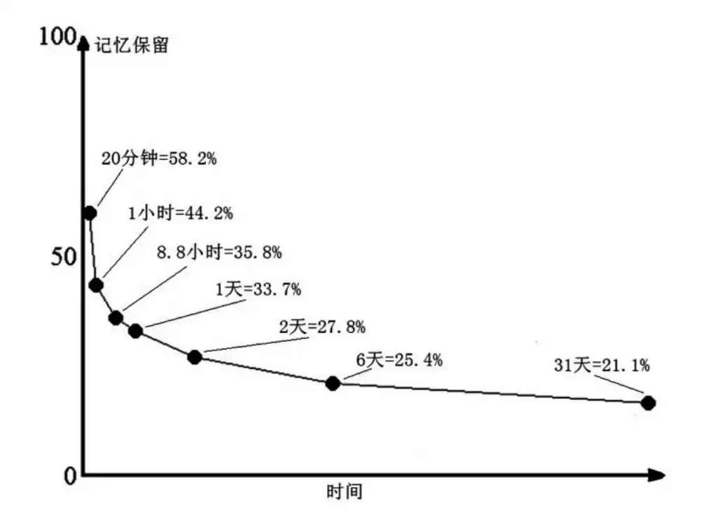
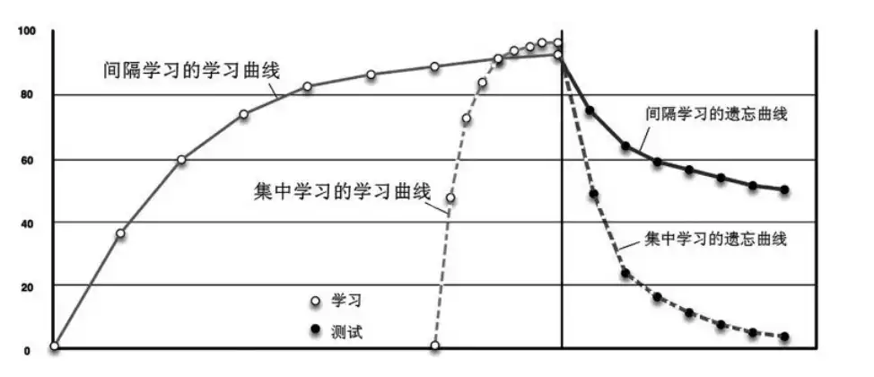
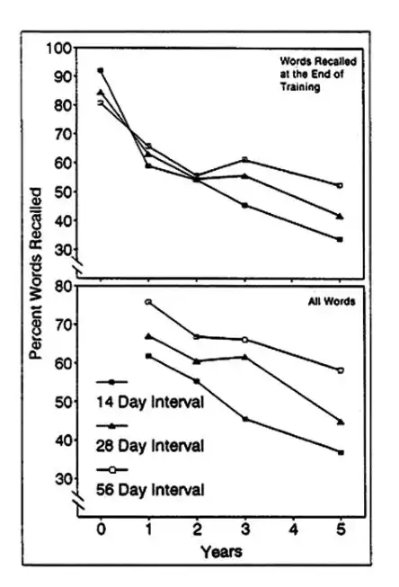

# 词行天下：像学母语一样学英语

## 见龙在田
### 记忆恒常深有解，法门百变新意无
>记忆存储的信息的有效使用，决定于大脑对这些信息在正确的时间和正确的形式下的取出机制。但最好的取出方式，决定于这些信息最初是被如何存入的。
>Alan Baddeley 《人类的记忆》

最好的存入方式 =》最好的取出方式=》信息的有效使用
最好的存入方式的特点：
1. 印象深刻
2. 完全理解《=》活学活用

曲线的含义
纵坐标：记忆保留
横坐标：时间
初始点为第一次能背诵完整内容，对应横坐标0，纵坐标100%

时间过去1天后，记忆保留位33.7%的含义：
1天33.7%，其中33.7%对应的是“减少的学习量”，也就是要1天过后，要再次背诵完整内容，不再需要最开始的1h了，工作量有所减少，减少的时间是 1h\*33.7% ≈20min，那么还需要的时间就是大约40min

>记忆不是 “有” 和 “无” 两种状态，而是大脑对某个内容的印象深浅程度问题。

- 印象深刻：能够回忆出来
- 印象浅薄：回忆不出来，但在思维潜层中仍有印象
我的理解：只要是完整记忆了，能够背诵，那么就一定有印象。过了一段时间想不起来，不是这段记忆忘记了、消失了，而是从深层跑到了浅层。相比于完全陌生的信息输入，将浅层记忆输入到深层需要的时间、精力有所减少

既然无法通过回忆来确定浅层记忆的比例，那只能通过复习的方式

#### 学习的节奏

间隔固定时间进行学习的遗忘曲线相比几种学习的遗忘曲线下降更平缓，也就是说间隔学习更适合需要长期记忆的知识
理论：编码多样化
>同一内容出现在不同条件和背景下，记忆效果比较好

**间隔时长的选择**
>学习间隔长短的选择，取决于保持记忆内容的最终目标，也就是说该记忆内容在学习停止多长时间后需要使用。
>学习停止后的记忆保持时间长短叫做“记忆周期”，retention interval，简称R.I
>如果希望记忆保持得长久，分散学习的“间隔时间”越长越好

上下两个图，
第一个图是间隔训练对于要记忆的单词量的掌握程度？规定了学习次数，在达到了次数后不再学习。
第二个图是相对于初始掌握的单词的遗忘曲线。结果显示间隔时间56天的记忆效果最好，能够记住的内容最多。

>全脱不如半脱，半脱不如不脱

短期记忆，快速学习的流程：
1. 用阅读和诵读等被动方式输入学习内容20分钟
2. 停止学习，并**立即**进行 “手眼协调”的文体活动，如投篮、手工、画画、弹琴等，10分钟
3. 立即再次投入学习，用总结和背诵等主动输出方式学习20分钟
4. 文体活动10min

**重复学习的次数**
>如果需要达到长期效果，那么包括首次学习在内的6次重复学习是最低限度，以7次为比较理想

